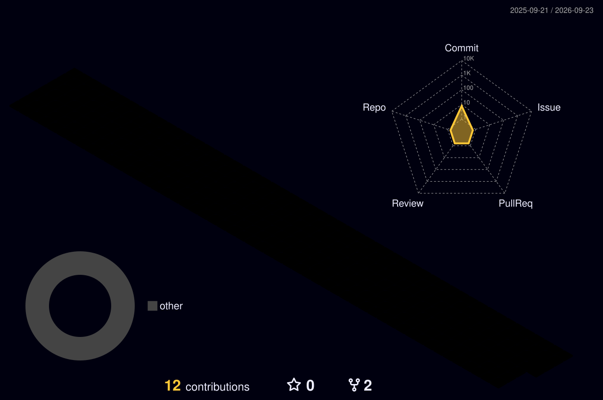

<!-- 캡슐 -->

<!--  -->

<h4>🤝 Contact 🤝</h4>
    
    

 
 

 
 

<!-- 

 
  -->

🧑‍💻 About me

<!-- <h3 align="left">🖥️ Languages &amp; Frameworks</h3> -->

<table width="100%">
  <thead>
    <tr>
      <th align="left" width="20%">Category</th>
      <th align="left" width="80%">Technologies</th>
    </tr>
  </thead>
  <tbody>
    <tr>
      <th align="left" scope="row">Languages</th>
      <td align="left">
        
        
        
        
        
      </td>
    </tr>
    <tr>
      <th align="left" scope="row">Frontend</th>
      <td align="left">
        
        
      </td>
    </tr>
    <tr>
      <th align="left" scope="row">Backend</th>
      <td align="left">
        
      </td>
    </tr>
    <tr>
      <th align="left" scope="row">Mobile</th>
      <td align="left">
        
      </td>
    </tr>
    <tr>
      <th align="left" scope="row">Database</th>
      <td align="left">
        
        
      </td>
    </tr>
    <tr>
      <th align="left" scope="row">Collaboration</th>
      <td align="left">
        
        
      </td>
    </tr>
    <tr>
      <th align="left" scope="row">IDE</th>
      <td align="left">
        
        
        
        
      </td>
    </tr>
  </tbody>
</table>
<!-- 
 -->

 
 

 
 

<!--     

 -->

 
 

<!-- 3D 잔디 시작 (START) -->

<!-- 3D 잔디 끝 (END) -->

 
 

<!-- Generated by .github/workflows/main.yml and published from the output branch. -->
<picture>
  <source
    media="(prefers-color-scheme: dark)"
    srcset="https://raw.githubusercontent.com/heeseungy/heeseungy/output/github-snake-dark.svg"
  />
  <source
    media="(prefers-color-scheme: light)"
    srcset="https://raw.githubusercontent.com/heeseungy/heeseungy/output/github-snake.svg"
  />
  
</picture>

 
 

<!-- 미사용 모음집 -->
<!-- REPO LAST COMMIT -->
<!--  -->

<!-- TOGGLE -->
<!-- 

 -->
